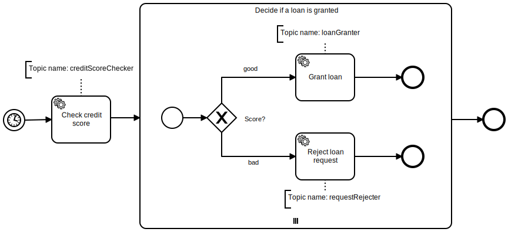
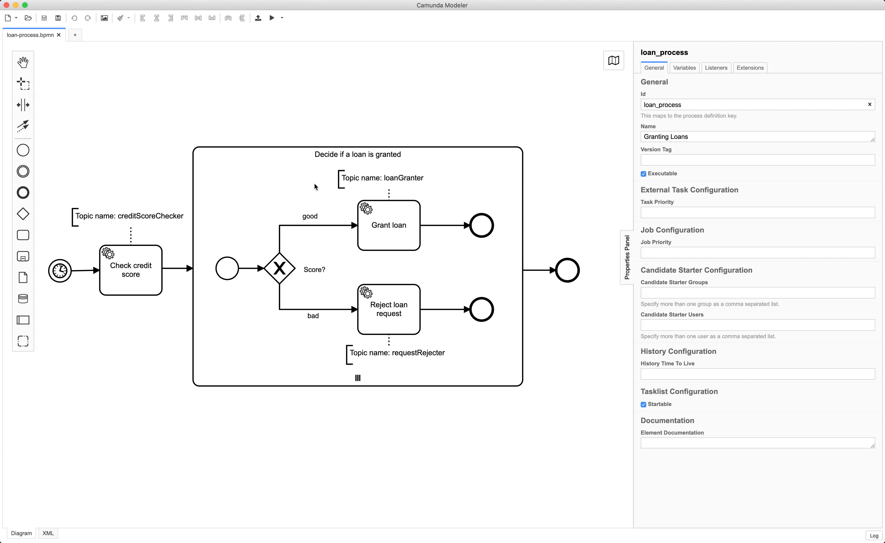

# Example
> You need to have rust and cargo installed, check out [rustup](https://rustup.rs/) of you don't have yet.

## Running the example

1. First, make sure to have [Camunda](https://camunda.com/download/) running.

2. Download the following [model](assets/loan-process.bpmn) and deploy it using the Camunda Modeler.

    

3. Run the example:

    Execute `cargo run` from the example directory.
